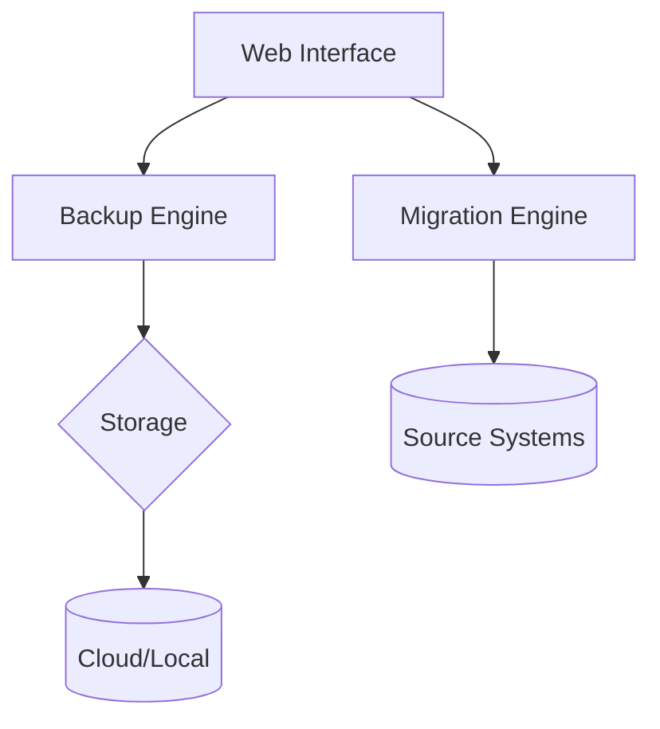

# Technical Documentation

## Architecture

## System Requirements
- **Odoo**: 17.0+
- **Python**: 3.10+
- **Storage**: Min 2x DB size for backups
- **RAM**: 4GB+ for large migrations

## API Endpoints
| Endpoint               | Method | Description                     |
|------------------------|--------|---------------------------------|
| `/backup/trigger`      | POST   | Start manual backup             |
| `/migration/validate`  | GET    | Pre-check source compatibility  |
| `/restore/status`      | GET    | Check restore progress          |

## Performance Benchmarks
| Operation          | 10k Records | 100k Records |
|--------------------|------------|-------------|
| Full Backup        | 1.2min     | 8.5min      |
| Incremental Backup | 15sec      | 45sec       |
| Migration          | 2.1min     | 18.3min     |

## Troubleshooting
**Error**: `Cloud Credential Rejected`  
**Solution**:  
1. Check IAM permissions  
2. Verify regional endpoints  
3. Enable debug mode for detailed logs